# InsightSent — Inteligência de Dados e Análise de Sentimentos


<p>&nbsp;</p>

## **Índice**
- Descrição do Projeto
- Arquitetura da Solução
- Metodologia de Data Science
- Documentação da API (Endpoints)
- Exemplos de Requisição e Resposta (JSON)
- Estrutura do Projeto & Visão Geral do Repositório
- Execução do Projeto
- Fluxogramas do Sistema
- Equipe
<p>&nbsp;</p>

## 📝 **Descrição do Projeto**

O **InsightSent** é uma plataforma de inteligência de dados desenvolvida para transformar o caos de feedbacks não estruturados em decisões estratégicas. 

Em um cenário onde **80% dos feedbacks de clientes são ignorados** por incapacidade de processamento manual, o InsightSent atua como uma central de inteligência que processa textos em tempo real, identifica o idioma (Português/Espanhol) e classifica o sentimento com alta precisão.

### **Diferenciais**
* 🚀 **Performance:** Respostas em menos de 100ms.
* 🌍 **Multilíngue:** Detecção automática de **PT-BR** e **ES** (Espanhol).
* 📊 **Inteligência Visual:** Dashboard integrado para acompanhamento de métricas.
* 🔒 **Segurança:** Arquitetura protegida com autenticação via Token JWT.


## ⚙️ **Arquitetura da Solução**

O projeto adota uma arquitetura de **Microserviços Conteinerizados**, garantindo escalabilidade e isolamento de responsabilidades.

#### **1. Backend (O Maestro)**
* **Tecnologia:** Java 21 + Spring Boot 3.4.5.
* **Função:** Orquestração de chamadas, gestão de segurança (Spring Security), validação de dados e comunicação com o banco.
* **Comunicação:** Utiliza **OpenFeign** para comunicação HTTP de baixa latência com o serviço de IA.

#### **2. Data Science (O Cérebro)**
* **Tecnologia:** Python 3.11 + FastAPI + Uvicorn.
* **Modelo:** Pipeline de Machine Learning utilizando **TF-IDF Vectorizer** (para transformar texto em números) e **Regressão Logística** (para classificação).
* **Treinamento:** Modelo treinado com um dataset unificado de ~470.000 avaliações (Olist, B2W e Amazon Reviews).

#### **3. Frontend (A Interface)**
* **Tecnologia:** Vanilla JavaScript (ES6+), HTML5 e CSS3.
* **Design:** Interface limpa, responsiva e focada na experiência do usuário (UX), comunicando-se via Fetch API com o Backend.

#### **4. Infraestrutura de Dados**
* **Banco de Dados:** PostgreSQL 15 rodando em container Docker.
* **Persistência:** Armazena usuários, logs de auditoria e histórico completo das análises para geração de insights futuros.
<p>&nbsp;</p>
  
Todas as Tecnologias Utilizadas:
<table width="100%">
  <thead>
    <tr>
      <th width="33%">Backend (Java/Spring)</th>
      <th width="33%">Data Science (Python)</th>
      <th width="33%">Infra/DevOps</th>
    </tr>
  </thead>
  <tbody>
    <tr>
      <td valign="top">
        <ul>
          <li>Java 17 + Spring Boot 3</li>
          <li>Spring Web (REST) - Endpoints</li>
          <li>Spring Security (JWT)</li>
          <li>Spring Validation</li>
          <li>Lombok</li>
          <li>OpenFeign (HTTP client → Python)</li>
          <li>H2 Database (em memória)</li>
          <li>JUnit + Mockito (testes)</li>
          <li>Swagger/OpenAPI (Docs)</li>
        </ul>
      </td>
      <td valign="top">
        <ul>
          <li>Python 3.10</li>
          <li>Pandas, NumPy, Scikit-learn</li>
          <li>Joblib (persistência)</li>
          <li>FastAPI + Uvicorn</li>
          <li>Datasets (Hugging Face/Kaggle)</li>
          <li>Imbalanced-learn</li>
          <li>NLTK / SpaCy (NLP)</li>
          <li>Matplotlib / Seaborn</li>
        </ul>
      </td>
      <td valign="top">
        <ul>
          <li>Git / GitHub (Monorepo)</li>
          <li>Docker + Docker Compose</li>
          <li>GitHub Actions (CI/CD)</li>
          <li>PlantUML (fluxogramas)</li>
        </ul>
      </td>
    </tr>
  </tbody>
</table>

> [!NOTE]
> O código do front-end encontra-se em funcionamento e integrado ao backend. Documentação e melhorias visuais poderão ser adicionadas nas próximas iterações do projeto.
<p>&nbsp;</p>

## 🧠 **Metodologia de Data Science**
O "cérebro" da aplicação utiliza um pipeline robusto para garantir precisão em múltiplos idiomas.

1.  **Datasets Unificados:** Treinamento realizado com ~470.000 avaliações combinadas de **Olist** (PT-BR), **B2W** (PT-BR) e **Amazon Reviews** (ES).
2.  **Balanceamento:** Aplicação de **SMOTE** (Synthetic Minority Over-sampling Technique) para evitar viés em classes minoritárias.
3.  **Vetorização:** Uso de **TF-IDF** para ponderar a relevância das palavras, ignorando ruídos (stopwords).
4.  **Modelo:** **Regressão Logística**, escolhida pelo equilíbrio ideal entre precisão e velocidade de inferência (<100ms).
<p>&nbsp;</p>

## 🔌 Documentação da API (Endpoints)
A API segue os padrões RESTful e está documentada via Swagger/OpenAPI. Abaixo estão as rotas principais para integração.

#### Autenticação & Usuários
| Método | Endpoint | Descrição | Nível de Acesso |
| :--- | :--- | :--- | :--- |
| `POST` | `/auth/register` | Cadastra um novo usuário no sistema. | Público |
| `POST` | `/auth/login` | Autentica credenciais e retorna o Bearer Token. | Público |

#### Core Business (Análise)
| Método | Endpoint | Descrição | Nível de Acesso |
| :--- | :--- | :--- | :--- |
| `POST` | `/analise` | Envia um texto para processamento. Retorna o Sentimento, Nível de Confiança (%) e Idioma detectado. | Autenticado |
| `GET` | `/analise/historico` | Retorna todo o histórico de análises realizadas pelo usuário logado. | Autenticado |
<p>&nbsp;</p>

## 🔌 **Exemplos de Requisição e Resposta (JSON)**
Para facilitar a integração, abaixo estão os exemplos reais de uso da API documentados no Swagger.
#### **1. Realizar Análise (`POST /analise`)**

Envia um texto cru e recebe a classificação enriquecida com metadados.
**Requisição:**

```json
{
  "texto": "O prazo de entrega foi cumprido com excelência, adorei!"
}
```
**Resposta (200 OK):**
```json
{
  "sentimento": "Positivo",
  "probabilidade": 0.9854,
  "idioma": "PT",
  "data_analise": "2026-01-18T14:30:00Z"
}
```
> [!NOTE]
> O campo idioma é gerado dinamicamente pela biblioteca langdetect no serviço Python.
<p>&nbsp;</p>

#### **2. Histórico (`GET /analise/historico`)**
Recupera os dados persistidos no PostgreSQL para popular o Dashboard.
**Resposta (200 OK):**
```json
[
  {
    "id": 153,
    "texto": "Não gostei do atendimento.",
    "sentimento": "Negativo",
    "probabilidade": 0.85,
    "idioma": "PT",
    "criado_em": "2026-01-18T10:00:00Z"
  },
  {
    "id": 154,
    "texto": "Me encanta este producto.",
    "sentimento": "Positivo",
    "probabilidade": 0.99,
    "idioma": "ES",
    "criado_em": "2026-01-18T10:05:00Z"
  }
]
```
<p>&nbsp;</p>

## 📁 **Estrutura do Projeto & Visão Geral do Repositório**

```
hackathon-sentimentapi-analytics
│
├── backend/                # API Gateway e Regras de Negócio (Java/Spring)
│   ├── src/...             # Controllers, Services, SecurityConfig, DTOs
│   ├── pom.xml
│   └── Dockerfile          # Multi-stage build (Maven + OpenJDK 21)
│
├── data/                   # Microsserviço de ML (Python/FastAPI)
│   ├── notebooks/          # Jupyter Notebooks
│   ├── model/              # Modelo treinado (.joblib)
│   ├── app.py              # API de Predição e Langdetect
│   ├── requirements.txt    # Dependências Python
│   └── Dockerfile          # Python 3.11 Slim (Otimizado)
│
├── frontend/               # Interface Web (HTML/JS/CSS)
│   ├── index.html
│   ├── server.py
│   └── src/
│       ├── assets/
│       │   ├── css/        # Estilos
│       │   └── js/         # Lógica de consumo da API (Fetch)
│       └── pages/          # Telas (Login, Dashboard, Análise)
│
├── docs/                   # Documentação
│   └── fluxogramas/
│       ├── fluxoCadastro.png
│       ├── fluxoLogin.png
│       └── fluxoAnalise.png
│
├── docker-compose.yml      # Orquestração dos serviços e rede interna
└── README.md               # Documentação principal do projeto
```
<p>&nbsp;</p>

## 🛠️ Execução do Projeto

### Como Executar no **(VSCODE)**

> [!IMPORTANT]
> O serviço Python **deve estar em execução antes** de iniciar o backend Java. O backend Java depende do serviço Python estar em execução.
> Este projeto é composto por dois serviços principais que devem ser executados separadamente:
> - Serviço de Machine Learning (Python + FastAPI)
> - API Backend (Java + Spring Boot)


#### Pré-requisitos

> Certifique-se de ter instalado:


#### 1. Executando o Serviço de Machine Learning (Python):
*Responsável por classificar o sentimento dos feedbacks.*

> Abra um terminal na raiz do projeto e rode o comando abaixo para acessar a pasta, instalar as dependências e rodar a aplicação:
```bash
cd data && pip install -r requirements.txt && uvicorn app:app --reload
```

| Serviço | Documentação |
| :--- | :--- |
| `http://localhost:8000` | `http://localhost:8000/docs` |

#### 2. Executando o Backend (Java + Spring Boot)
*Responsável por expor a API REST e integrar com o serviço Python.*

> Abra outro terminal na raiz do projeto e rode o comando abaixo para acessar a pasta e rodar a aplicação:
```bash
cd backend && mvn spring-boot:run
```
| Serviço | Documentação |
| :--- | :--- |
| `http://localhost:8080` | `http://localhost:8080/swagger-ui.html` |

#### 3. Encerrando a Aplicação.
> Fazer em ambos os terminais (Python e Java).
```bash
CTRL + C
```
<p>&nbsp;</p>

#### Fluxo de Funcionamento

1. O cliente envia um feedback para a API Java

2. O backend chama o serviço Python via HTTP (OpenFeign)

3. O modelo de Machine Learning classifica o sentimento

4. O resultado é retornado e persistido no banco H2
<p>&nbsp;</p>


### Como Executar no **(Docker)**

O projeto foi desenhado para ser executado com um único comando, abstraindo a complexidade de configuração de ambientes.

> Certifique-se de ter instalado:


#### **Execute a aplicação:**

> Abra um terminal e rode o comando abaixo para baixar o repositório, entrar no diretório e subir os containers (Build & Run):
```bash
git clone https://github.com/amaro-netto/hackathon-sentimentapi-analytics.git && cd hackathon-sentimentapi-analytics && docker-compose up --build -d
```
*Isso irá compilar o Java, construir a imagem Python, subir o banco PostgreSQL e configurar a rede interna.*

| Frontend | API Java (Swagger) | API Python (Docs) |
| :--- | :--- | :--- |
| `http://localhost:80` | `http://localhost:8080/swagger-ui.html` | `http://localhost:8000/docs` |
<p>&nbsp;</p>

## 📊 Fluxogramas do Sistema
Abaixo estão os fluxos principais da aplicação:

#### **Pipeline**

```mermaid
sequenceDiagram
    participant User as 👤 Usuário
    participant Front as 💻 Frontend
    participant Java as ☕ Backend API (Java)
    participant AI as 🧠 IA Service (Python)
    participant DB as 🗄️ PostgreSQL

    User->>Front: Digita o texto e clica em "Analisar"
    Front->>Java: POST /analise (c/ Token JWT)
    Java->>Java: Valida Token & Permissões
    Java->>AI: Envia texto cru (OpenFeign)
    AI->>AI: Detecta Idioma (PT/ES)
    AI->>AI: Vetorização (TF-IDF) + Predição
    AI-->>Java: Retorna JSON {sentimento, score, idioma}
    Java->>DB: Salva log da análise (Persistência)
    Java-->>Front: Retorna Resultado Completo
    Front-->>User: Exibe Gráfico de Confiança e Cor
```


<table>
  <tr>
    <td align="center" width="33.33%">
      <p>🔐 Fluxo de Cadastro</p>
    </td>
    <td align="center" width="33.33%">
      <p>🔑 Fluxo de Login</p>
    </td>
    <td align="center" width="33.33%">
      <p>💬 Fluxo de Análise de Sentimento</p>
    </td>
  </tr>
  <tr>
    <td align="center">
      Representa o processo de criação de um novo usuário no sistema.
    </td>
    <td align="center">
      Representa o processo de autenticação de um usuário no sistema.
    </td>
    <td align="center">
      Representa o processo de classificação automática de feedbacks em positivo, negativo ou neutro.
    </td>
  </tr>
  <tr>
    <td align="center">
      
    </td>
    <td align="center">
      
    </td>
    <td align="center">
      
    </td>
  </tr>
</table>
<p>&nbsp;</p>

### 👥 **Equipe DevstechOne**
Este projeto foi desenvolvido com orgulho durante o Hackathon ONE II - Brasil. `📅 08 Dez 2025 - 21 Jan 2026`

<a href="https://github.com/alessandroapolinario" title="Alessandro Apolin"></a> <a href="https://github.com/amaro-netto" title="Amaro Netto"></a> <a href="https://github.com/brunorm86" title="Bruno Machado"></a> <a href="https://github.com/MicheleLescano" title="Michele Lescano"></a> <a href="https://github.com/Rshinna" title="Rodrigo Franco"></a>
<p>&nbsp;</p>

----
<div align="center">
  <strong>© 2026 InsightSent</strong> - Desenvolvido por <em>DevstechOne</em>.
</div>
