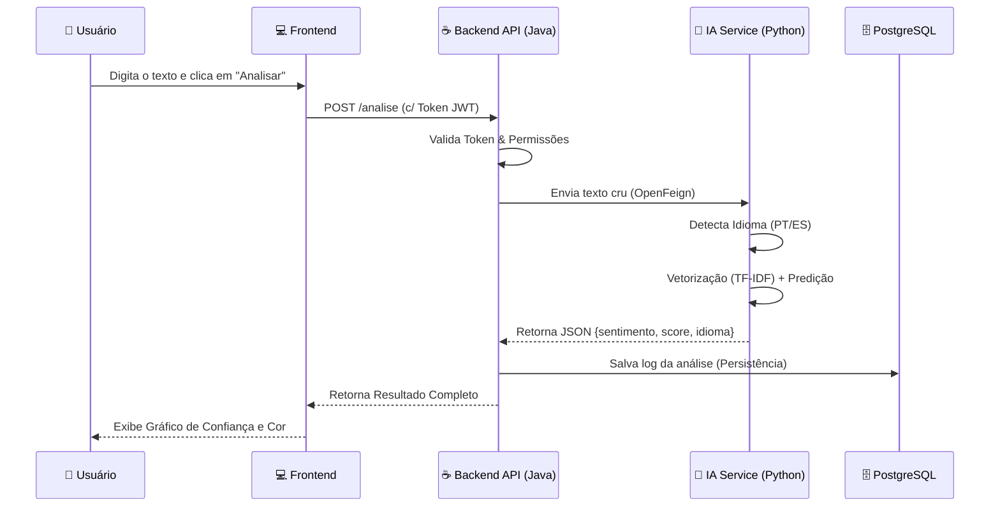

# InsightSent — Inteligência de Dados e Análise de Sentimentos


### **Índice**
- Descrição do Projeto
- Front-end
- Tecnologias Utilizadas
- Estrutura do Projeto
- Execução do Projeto
- Fluxogramas do Sistema
- Equipe


### 📝 **Descrição do Projeto**

O **InsightSent** é uma plataforma de inteligência de dados desenvolvida para transformar o caos de feedbacks não estruturados em decisões estratégicas. 

Em um cenário onde **80% dos feedbacks de clientes são ignorados** por incapacidade de processamento manual, o InsightSent atua como uma central de inteligência que processa textos em tempo real, identifica o idioma (Português/Espanhol) e classifica o sentimento com alta precisão.

### **Diferenciais**
* 🚀 **Performance:** Respostas em menos de 100ms.
* 🌍 **Multilíngue:** Detecção automática de **PT-BR** e **ES** (Espanhol).
* 📊 **Inteligência Visual:** Dashboard integrado para acompanhamento de métricas.
* 🔒 **Segurança:** Arquitetura protegida com autenticação via Token JWT.


## ⚙️ **Arquitetura da Solução**

O projeto adota uma arquitetura de **Microserviços Conteinerizados**, garantindo escalabilidade e isolamento de responsabilidades.

### **1. Backend (O Maestro)**
* **Tecnologia:** Java 21 + Spring Boot 3.4.5.
* **Função:** Orquestração de chamadas, gestão de segurança (Spring Security), validação de dados e comunicação com o banco.
* **Comunicação:** Utiliza **OpenFeign** para comunicação HTTP de baixa latência com o serviço de IA.

### **2. Data Science (O Cérebro)**
* **Tecnologia:** Python 3.11 + FastAPI + Uvicorn.
* **Modelo:** Pipeline de Machine Learning utilizando **TF-IDF Vectorizer** (para transformar texto em números) e **Regressão Logística** (para classificação).
* **Treinamento:** Modelo treinado com um dataset unificado de ~470.000 avaliações (Olist, B2W e Amazon Reviews).

### **3. Frontend (A Interface)**
* **Tecnologia:** Vanilla JavaScript (ES6+), HTML5 e CSS3.
* **Design:** Interface limpa, responsiva e focada na experiência do usuário (UX), comunicando-se via Fetch API com o Backend.

### **4. Infraestrutura de Dados**
* **Banco de Dados:** PostgreSQL 15 rodando em container Docker.
* **Persistência:** Armazena usuários, logs de auditoria e histórico completo das análises para geração de insights futuros.
  
**Todas as Tecnologias Utilizadas**
| Backend (Java/Spring) | Data Science (Python) | Infra/DevOps |
| :--- | :--- | :--- |
| • Java 17 + Spring Boot 3<br>• Spring Web (REST) - Endpoints<br>• Spring Security (JWT)<br>• Spring Validation<br>• Lombok<br>• OpenFeign (HTTP client → Python)<br>• H2 Database (em memória)<br>• JUnit + Mockito (testes)<br>• Swagger/OpenAPI (Docs) | • Python 3.10<br>• Pandas, NumPy, Scikit-learn<br>• Joblib (persistência)<br>• FastAPI + Uvicorn<br>• Datasets (Hugging Face/Kaggle)<br>• Imbalanced-learn<br>• NLTK / SpaCy (NLP)<br>• Matplotlib / Seaborn | • Git / GitHub (Monorepo)<br>• Docker + Docker Compose<br>• GitHub Actions (CI/CD)<br>• PlantUML (fluxogramas) |

> [!NOTE]
> O código do front-end encontra-se em funcionamento e integrado ao backend. Documentação e melhorias visuais poderão ser adicionadas nas próximas iterações do projeto.

### 📁 **Estrutura do Projeto & Visão Geral do Repositório**

```
hackathon-sentimentapi-analytics
│
├── backend/                # API Java (Spring Boot)
│   ├── src/...
│   └── pom.xml
│
├── data/                   # Serviço de Machine Learning (Python)
│   ├── notebooks/          # Jupyter Notebooks
│   ├── model/              # Modelo treinado (.joblib)
│   ├── app.py              # FastAPI
│   └── requirements.txt    # Dependências Python
│
├── frontend/               # Interface Web
│   ├── index.html
│   ├── server.py
│   └── src/
│       ├── assets/
│       │   ├── css/        # Estilos
│       │   └── js/         # Scripts
│       └── pages/          # Páginas HTML
│
├── docs/                   # Documentação
│   └── fluxogramas/
│       ├── fluxoCadastro.png
│       ├── fluxoLogin.png
│       ├── fluxoAnalise.png
│       └── INFO.TXT
│
└── README.md               # Documentação principal do projeto
```


## Execução do Projeto

### Como Executar **(VSCODE)**

> [!IMPORTANT]
> O serviço Python **deve estar em execução antes** de iniciar o backend Java.
> 
> O backend Java depende do serviço Python estar em execução.


Este projeto é composto por dois serviços principais que devem ser executados separadamente:

- Serviço de Machine Learning (Python + FastAPI)
- API Backend (Java + Spring Boot)


#### Pré-requisitos

#### **Certifique-se de ter instalado:**


#### 1. Executando o Serviço de Machine Learning (Python)
Responsável por classificar o sentimento dos feedbacks.

Abra um terminal na raiz do projeto e rode o comando abaixo para acessar a pasta, instalar as dependências e rodar a aplicação:
```bash
cd data && pip install -r requirements.txt && uvicorn app:app --reload
```

| Serviço | Documentação |
| :--- | :--- |
| `http://localhost:8000` | `http://localhost:8000/docs` |

#### ☕ 2. Executando o Backend (Java + Spring Boot)
Responsável por expor a API REST e integrar com o serviço Python.

Abra outro terminal na raiz do projeto e rode o comando abaixo para acessar a pasta e rodar a aplicação:
```bash
cd backend && mvn spring-boot:run
```
| Serviço | Documentação |
| :--- | :--- |
| `http://localhost:8080` | `http://localhost:8080/swagger-ui.html` |
 

#### 🔁 Fluxo de Funcionamento

1. O cliente envia um feedback para a API Java

2. O backend chama o serviço Python via HTTP (OpenFeign)

3. O modelo de Machine Learning classifica o sentimento

4. O resultado é retornado e persistido no banco H2

#### 🛑 Encerrando a Aplicação

```bash
CTRL + C
```
em ambos os terminais (Python e Java).

### Como Executar **(Docker)**

O projeto foi desenhado para ser executado com um único comando, abstraindo a complexidade de configuração de ambientes.

#### **Certifique-se de ter instalado:**


#### **Execute a aplicação:**

**Abra um terminal e rode o comando abaixo para acessar baixar o repositório, entrar no diretório e sobe os containers (Build & Run):**

```bash
git clone https://github.com/amaro-netto/hackathon-sentimentapi-analytics.git && cd hackathon-sentimentapi-analytics && docker-compose up --build -d
```
*Isso irá compilar o Java, construir a imagem Python, subir o banco PostgreSQL e configurar a rede interna.*

| Frontend | API Java (Swagger) | API Python (Docs) |
| :--- | :--- | :--- |
| `http://localhost:80` | `http://localhost:8080/swagger-ui.html` | `http://localhost:8000/docs` |

## 📊 Fluxogramas do Sistema

Abaixo estão os fluxos principais da aplicação:

#### 📊 **Fluxo de Dados (Pipeline)**


<table>
  <tr>
    <td align="center" width="33.33%">
      <p>🔐 Fluxo de Cadastro</p>
    </td>
    <td align="center" width="33.33%">
      <p>🔑 Fluxo de Login</p>
    </td>
    <td align="center" width="33.33%">
      <p>💬 Fluxo de Análise de Sentimento</p>
    </td>
  </tr>
  <tr>
    <td align="center">
      Representa o processo de criação de um novo usuário no sistema.
    </td>
    <td align="center">
      Representa o processo de autenticação de um usuário no sistema.
    </td>
    <td align="center">
      Representa o processo de classificação automática de feedbacks em positivo, negativo ou neutro.
    </td>
  </tr>
  <tr>
    <td align="center">
      
    </td>
    <td align="center">
      
    </td>
    <td align="center">
      
    </td>
  </tr>
</table>

### 👥 **Equipe DevstechOne**
Este projeto foi desenvolvido com orgulho durante o Hackathon ONE.

<a href="https://github.com/alessandroapolinario" title="Alessandro Apolin"></a> <a href="https://github.com/amaro-netto" title="Amaro Netto"></a> <a href="https://github.com/brunorm86" title="Bruno Machado"></a> <a href="https://github.com/MicheleLescano" title="Michele Lescano"></a> <a href="https://github.com/Rshinna" title="Rodrigo Franco"></a>

----
<div align="center">
  <strong>© 2026 InsightSent</strong> - Desenvolvido por <em>DevstechOne</em>.
</div>
