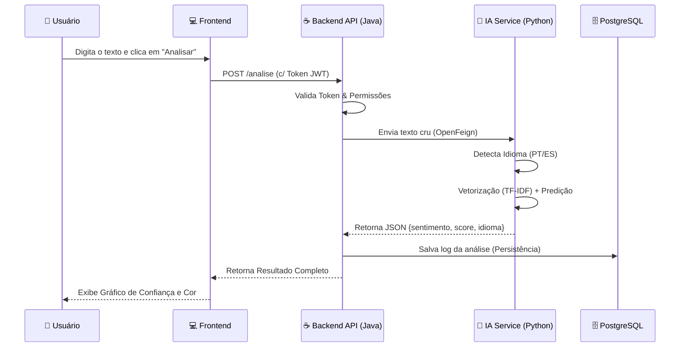
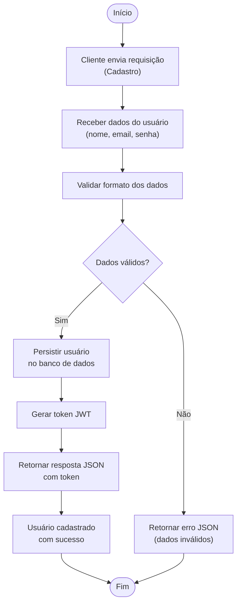
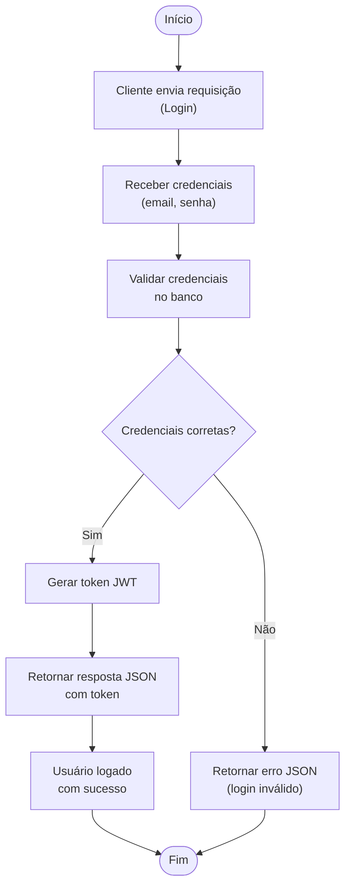
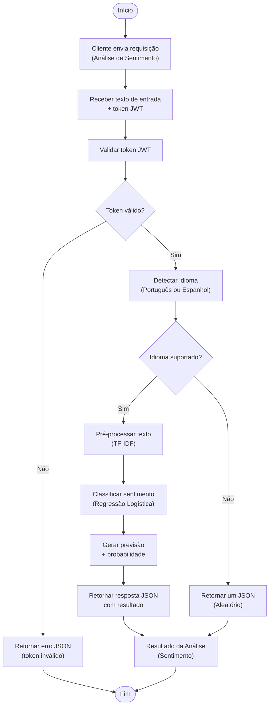

# InsightSent — Inteligência de Dados e Análise de Sentimentos


---

### **Índice**
- Descrição do Projeto
- Front-end
- Tecnologias Utilizadas
- Estrutura do Projeto
- Execução do Projeto
- Fluxogramas do Sistema
- Equipe

---

### 📝 **Descrição do Projeto**

O **InsightSent** é uma plataforma de inteligência de dados desenvolvida para transformar o caos de feedbacks não estruturados em decisões estratégicas. 

Em um cenário onde **80% dos feedbacks de clientes são ignorados** por incapacidade de processamento manual, o InsightSent atua como uma central de inteligência que processa textos em tempo real, identifica o idioma (Português/Espanhol) e classifica o sentimento com alta precisão.

### **Diferenciais**
* 🚀 **Performance:** Respostas em menos de 100ms.
* 🌍 **Multilíngue:** Detecção automática de **PT-BR** e **ES** (Espanhol).
* 📊 **Inteligência Visual:** Dashboard integrado para acompanhamento de métricas.
* 🔒 **Segurança:** Arquitetura protegida com autenticação via Token JWT.

---

## ⚙️ **Arquitetura da Solução**

O projeto adota uma arquitetura de **Microserviços Conteinerizados**, garantindo escalabilidade e isolamento de responsabilidades.

### **1. Backend (O Maestro)**
* **Tecnologia:** Java 21 + Spring Boot 3.4.5.
* **Função:** Orquestração de chamadas, gestão de segurança (Spring Security), validação de dados e comunicação com o banco.
* **Comunicação:** Utiliza **OpenFeign** para comunicação HTTP de baixa latência com o serviço de IA.

### **2. Data Science (O Cérebro)**
* **Tecnologia:** Python 3.11 + FastAPI + Uvicorn.
* **Modelo:** Pipeline de Machine Learning utilizando **TF-IDF Vectorizer** (para transformar texto em números) e **Regressão Logística** (para classificação).
* **Treinamento:** Modelo treinado com um dataset unificado de ~470.000 avaliações (Olist, B2W e Amazon Reviews).

### **3. Frontend (A Interface)**
* **Tecnologia:** Vanilla JavaScript (ES6+), HTML5 e CSS3.
* **Design:** Interface limpa, responsiva e focada na experiência do usuário (UX), comunicando-se via Fetch API com o Backend.

### **4. Infraestrutura de Dados**
* **Banco de Dados:** PostgreSQL 15 rodando em container Docker.
* **Persistência:** Armazena usuários, logs de auditoria e histórico completo das análises para geração de insights futuros.

---

## 📊 **Fluxo de Dados (Pipeline)**



> [!NOTE]
> O código do front-end encontra-se em funcionamento e integrado ao backend. Documentação e melhorias visuais poderão ser adicionadas nas próximas iterações do projeto.


### ⚙️ **Tecnologias Utilizadas**
Seguindo a arquitetura de microserviços, adotaremos a seguinte stack:
  
**Backend:** 
* Java 17 + Spring Boot 3 - API /sentiment
* Spring Web (REST) - Endpoints
* Spring Security (JWT)
* Spring Validation
* Lombok
* OpenFeign (HTTP client → Python)
* H2 Database (em memória)
* JUnit + Mockito (testes)
* Swagger/OpenAPI (Documentação)

**Data Science:**
  * Python 3.10 
  * Pandas, NumPy, Scikit-learn  
  * Joblib (persistência de modelo)  
  * FastAPI + Uvicorn (servidor de predição) 
  * Datasets (Hugging Face) 
  * Huggingface Hub  
  * KaggleHub 
  * Imbalanced-learn (tratamento de dados desbalanceados) 
  * NLTK / SpaCy (pré-processamento de texto, se aplicável) 
  * Matplotlib / Seaborn (visualização de dados) 
  

**Infra/Dev:**
* Git / GitHub (Monorepo)
* Docker + Docker Compose
* GitHub Actions (CI/CD)
* PlantUML(fluxogramas)

**Build/Deploy:**
* Oracle Cloud (futuro) 

### 📁 **Estrutura do Projeto**
* `/backend` - Código fonte da API Java
* `/data` - Notebooks e scripts de treinamento do modelo
* `/docs` - Documentação e fluxogramas
  * `fluxoCadastro.png` — Fluxo de cadastro de usuário 
  * `fluxoLogin.png` — Fluxo de autenticação  
  * `fluxoAnalise.png` — Fluxo de análise de sentimento 
  * `INFO.TXT` — Informações complementares 
* `/frontend` — Interface web da aplicação
  * `index.html` — Página inicial
  * `README.md` — Documentação do front-end
  * `server.py` — Script de servidor local (opcional)
  * `/src`
    * `/assets`
      * `/css`
        - app.css
        - dashboard.css
        - login.css
        - style.css
      * `/js`
        - auth-guard.js
        - dashboard.js
        - layout.js
        - login.js
        - register.js
        - script.js
    * `/pages`
      - dashboard.html
      - register.html
      - sentiment.html

#### Visão Geral do Repositório
```
hackathon-sentimentapi-analytics
│
├── backend/                # API Java (Spring Boot)
│   ├── src/...
│   └── pom.xml
│
├── data/                   # Serviço de Machine Learning (Python)
│   ├── notebooks/          # Jupyter Notebooks
│   ├── model/              # Modelo treinado (.joblib)
│   ├── app.py              # FastAPI
│   └── requirements.txt    # Dependências Python
│
├── frontend/               # Interface Web
│   ├── index.html
│   ├── server.py
│   └── src/
│       ├── assets/
│       │   ├── css/        # Estilos
│       │   └── js/         # Scripts
│       └── pages/          # Páginas HTML
│
├── docs/                   # Documentação
│   └── fluxogramas/
│       ├── fluxoCadastro.png
│       ├── fluxoLogin.png
│       ├── fluxoAnalise.png
│       └── INFO.TXT
│
└── README.md               # Documentação principal do projeto
```
---
## Execução do Projeto

### Como Executar **(VSCODE)**

> [!IMPORTANT]
> o serviço Python **deve estar em execução antes** de iniciar o backend Java.


Este projeto é composto por dois serviços principais que devem ser executados separadamente:

- Serviço de Machine Learning (Python + FastAPI)
- API Backend (Java + Spring Boot)

> [!IMPORTANT]
> O backend Java depende do serviço Python estar em execução.

#### 🔹 Pré-requisitos

Certifique-se de ter instalado:

- Java 17+

- Maven 3.8+

- Python 3.10+

- Git

#### 🐍 1. Executando o Serviço de Machine Learning (Python)

Responsável por classificar o sentimento dos feedbacks.
```bash
cd data
```

Crie e ative um ambiente virtual (opcional, mas recomendado):
```bash
python -m venv venv
source venv/bin/activate   # Linux/Mac
venv\Scripts\activate      # Windows
```

Instale as dependências:
```bash
pip install -r requirements.txt
```

Execute a API FastAPI:
```bash
uvicorn app:app --reload
```

📍 O serviço estará disponível em:
👉 http://localhost:8000

📄 Documentação automática (Swagger):
👉 http://localhost:8000/docs


#### ☕ 2. Executando o Backend (Java + Spring Boot)

Responsável por expor a API REST e integrar com o serviço Python.
```bash
cd backend
```
Execute a aplicação:
```bash
mvn spring-boot:run

```
📍 A API estará disponível em:
👉 http://localhost:8080

📄 Documentação Swagger/OpenAPI:
👉 http://localhost:8080/swagger-ui.html

#### 🔁 Fluxo de Funcionamento

1. O cliente envia um feedback para a API Java

2. O backend chama o serviço Python via HTTP (OpenFeign)

3. O modelo de Machine Learning classifica o sentimento

4. O resultado é retornado e persistido no banco H2

#### 🛑 Encerrando a Aplicação

Para encerrar os serviços, utilize:
```bash
CTRL + C
```
em ambos os terminais (Python e Java).

## Como Executar **(Docker)**

O projeto foi desenhado para ser executado com um único comando, abstraindo a complexidade de configuração de ambientes.

### **Pré-requisitos**
* Docker e Docker Compose instalados.

### **Passo a Passo**

1.  **Clone o repositório:**
    ```bash
    git clone [https://github.com/amaro-netto/hackathon-sentimentapi-analytics.git](https://github.com/amaro-netto/hackathon-sentimentapi-analytics.git)
    cd hackathon-sentimentapi-analytics
    ```

2.  **Suba a aplicação (Build & Run):**
    ```bash
    docker-compose up --build -d
    ```
    *Isso irá compilar o Java, construir a imagem Python, subir o banco PostgreSQL e configurar a rede interna.*

3.  **Acesse o Sistema:**
    * **Frontend (Aplicação):** `http://localhost:80` (Login e Dashboard)
    * **API Java (Swagger):** `http://localhost:8080/swagger-ui.html`
    * **API Python (Docs):** `http://localhost:8000/docs`

---
### 📊 Fluxogramas do Sistema

Abaixo estão os fluxos principais da aplicação:

#### 🔐 Fluxo de Cadastro
Representa o processo de criação de um novo usuário no sistema. 



#### 🔑 Fluxo de Login
Representa o processo de autenticação de um usuário no sistema. 



#### 💬 Fluxo de Análise de Sentimento
Representa o processo de classificação automática de feedbacks em positivo, negativo ou neutro.


---

### 👥 **Equipe do Projeto**

<a href="https://github.com/alessandroapolinario" title="Alessandro Apolin"></a> <a href="https://github.com/amaro-netto" title="Amaro Netto"></a> <a href="https://github.com/brunorm86" title="Bruno Machado"></a> <a href="https://github.com/MicheleLescano" title="Michele Lescano"></a> <a href="https://github.com/Rshinna" title="Rodrigo Franco"></a> 

